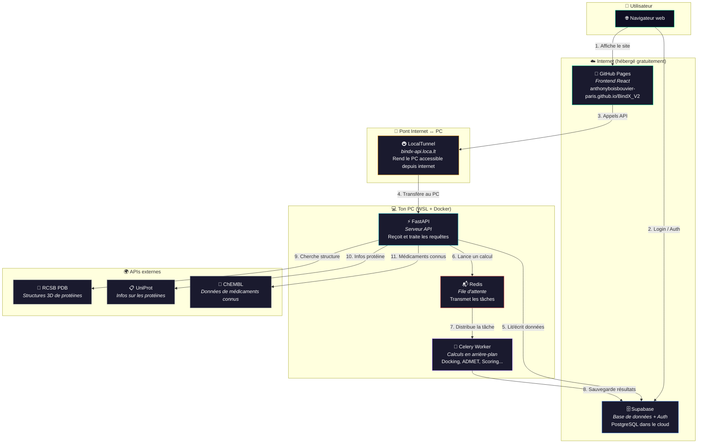
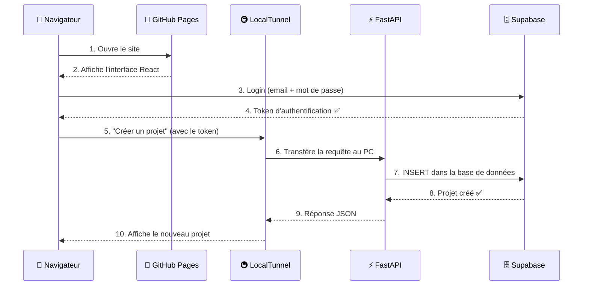
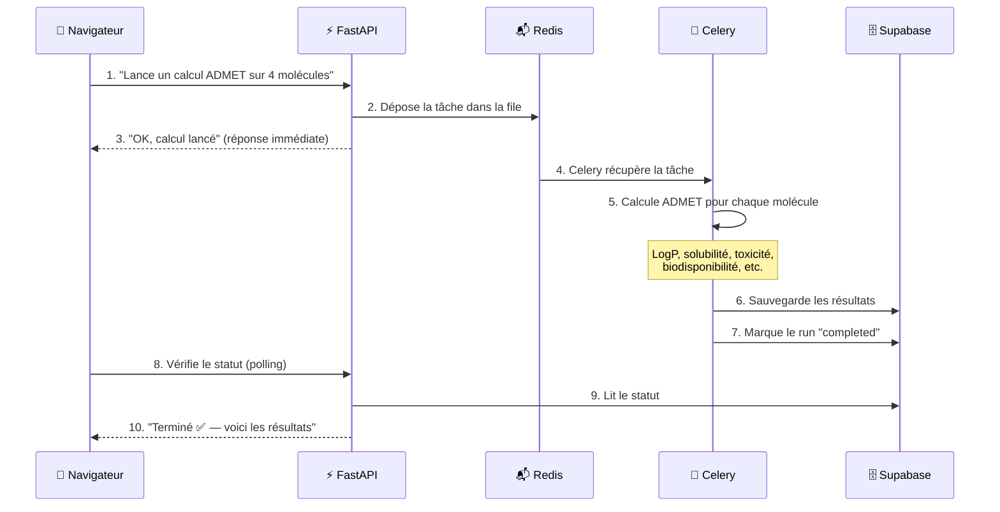
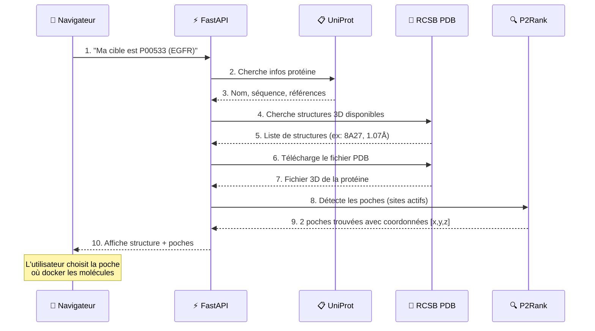
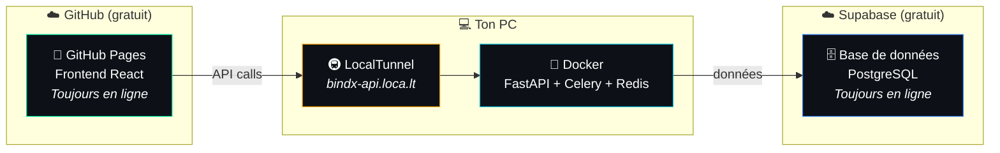

# BindX V9 — Architecture

> Plateforme de découverte de médicaments in silico.
> Ce document explique comment toutes les pièces du projet s'assemblent.

---

## Vue d'ensemble



---

## Parcours d'une requête utilisateur

Quand tu cliques "Créer un projet" dans le navigateur, voici ce qui se passe :



---

## Parcours d'un calcul (ex: ADMET)

Les calculs longs (docking, ADMET, scoring...) sont traités en arrière-plan pour ne pas bloquer l'interface :



---

## Résolution d'une cible protéique

Quand tu configures la cible d'un projet (ex: EGFR), le système cherche automatiquement la meilleure structure 3D :



---

## Organisation des données

Le modèle de données suit la logique d'un projet de drug discovery :

```mermaid
graph TD
    Project["🎯 Projet<br/><i>1 cible protéique</i><br/>Ex: EGFR"]
    Campaign["📋 Campagne<br/><i>1 stratégie = cible + poche + règles</i><br/>Ex: Poche 1 du EGFR"]
    PhaseA["🔬 Phase A — Hit Discovery<br/><i>Trouver des molécules actives</i><br/>dans une librairie"]
    PhaseB["⚗️ Phase B — Hit-to-Lead<br/><i>Optimiser les meilleurs hits</i><br/>générer des analogues"]
    PhaseC["💎 Phase C — Lead Optimization<br/><i>Affiner avec ADMET complet</i><br/>préparer pour le labo"]
    Run["▶️ Run<br/><i>1 unité de calcul</i><br/>Import, Docking, ADMET..."]
    Mol["💊 Molécule<br/><i>1 ligne dans le tableau</i><br/>SMILES + propriétés calculées"]

    Project -->|"contient"| Campaign
    Campaign -->|"contient 3 phases"| PhaseA
    Campaign -->|""| PhaseB
    Campaign -->|""| PhaseC
    PhaseA -->|"contient des"| Run
    PhaseA -->|"contient des"| Mol
    PhaseB -->|"contient des"| Run
    PhaseB -->|"contient des"| Mol
    PhaseC -->|"contient des"| Run
    PhaseC -->|"contient des"| Mol

    style Project fill:#1e3a5f,stroke:#00e6a0,color:#fff
    style Campaign fill:#1e3a5f,stroke:#06b6d4,color:#fff
    style PhaseA fill:#1e3a5f,stroke:#3b82f6,color:#fff
    style PhaseB fill:#1e3a5f,stroke:#8b5cf6,color:#fff
    style PhaseC fill:#1e3a5f,stroke:#22c55e,color:#fff
    style Run fill:#2d2d44,stroke:#f59e0b,color:#fff
    style Mol fill:#2d2d44,stroke:#ec4899,color:#fff
```

---

## Les 9 types de calcul

Chaque **Run** effectue un type de calcul. Les résultats apparaissent comme colonnes dans le tableau :

| Type | Ce qu'il fait | Résultats |
|------|--------------|-----------|
| **Import** | Charge des molécules (SMILES, fichier SDF) | Nom, SMILES |
| **Docking** | Simule la fixation molécule ↔ protéine | Score de docking, score CNN |
| **ADMET** | Prédit absorption, distribution, métabolisme, excrétion, toxicité | LogP, solubilité, BBB, biodisponibilité |
| **Scoring** | Calcule un score composite pondéré | Score composite (0-1) |
| **Safety** | Évalue la toxicité (hERG, AMES, hépatotoxicité) | Code couleur sécurité (vert/jaune/rouge) |
| **Confidence** | Vérifie la fiabilité des prédictions (PAINS, domaine d'applicabilité) | Score de confiance (0-1) |
| **Clustering** | Regroupe les molécules similaires par scaffold | Cluster ID, similarité Tanimoto |
| **Enrichment** | Analyse les interactions protéine-ligand (ProLIF) | Nombre de contacts, scaffold |
| **Retrosynthesis** | Évalue la faisabilité de synthèse | Étapes, coût, disponibilité réactifs |
| **Off-target** | Teste la sélectivité (autres protéines) | Score sélectivité, hits off-target |

---

## Déploiement actuel (staging)



**Comment ça marche :**
- Le **frontend** (interface) est hébergé gratuitement sur GitHub → toujours accessible
- La **base de données** est sur Supabase → toujours accessible
- Le **backend** (calculs) tourne sur ton PC → accessible uniquement quand ton PC est allumé + tunnel lancé

**Pour démarrer :** double-clic sur "BindX Start" sur le bureau.

---

## Stack technique

| Couche | Technologie | Rôle |
|--------|------------|------|
| **Frontend** | React + Vite + Tailwind | Interface utilisateur (tableau, graphiques, 3D) |
| **State** | Zustand | Gestion de l'état côté navigateur |
| **API** | FastAPI (Python) | Serveur qui traite les requêtes |
| **Tâches** | Celery + Redis | Exécution des calculs longs en arrière-plan |
| **Base de données** | Supabase (PostgreSQL) | Stockage des projets, molécules, résultats |
| **Auth** | Supabase Auth (JWT) | Login / inscription sécurisé |
| **Chimie** | RDKit, GNINA, P2Rank | Calculs moléculaires, docking, détection de poches |
| **IA/ML** | PyTorch, admet-ai | Prédictions ADMET par intelligence artificielle |
| **Conteneurs** | Docker Compose | Emballe tout dans des boîtes isolées |
| **Hébergement** | GitHub Pages + LocalTunnel | Frontend gratuit + tunnel vers le PC |

---

*Dernière mise à jour : mars 2026*
